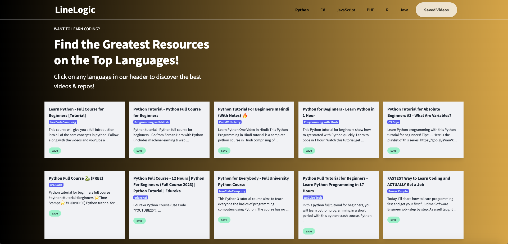
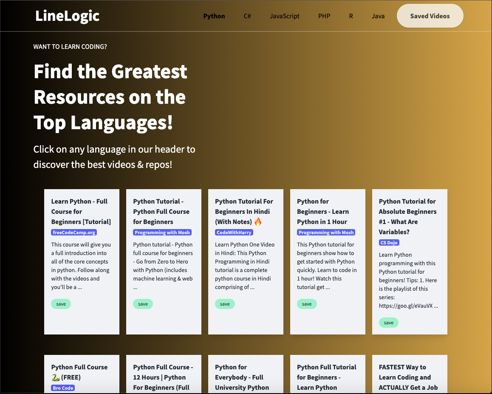

# LineLogic

LineLogic is a website that pulls data from the YouTube API and GitHub API using the Tailwind CSS framework. It is designed to be responsive, providing a seamless user experience on different devices.

## User Story

```
As a web developer, I want to be able to retrieve data from both YouTube and GitHub APIs so that I can display relevant information on my website.
```

## Acceptance Criteria

```
GIVEN I need a youtube videos about a programming language WHEN I click the programming language button
GIVEN I need a github repositories about a programming language 
WHEN I click the programming language button
GIVEN I want to save youtube videos
WHEN I click save the button on youtube videos
GIVEN I want to visit the top repositories of a programming language
WHEN I click the visit button in the repository table row
GIVEN I need to view the saved videos 
WHEN clicked the saved button the saved videos are displayed
```

## Technologies Used

* HTML5
* CSS3 (Tailwind CSS framework)
* JavaScript
* Server-side API


## Key Features

* *Responsive design using Tailwind CSS framework
* Modal popups instead of alerts, confirms, or prompts
* Client-side storage for persistent data
* Polished UI with a clean and modern look
* Clean repository that meets coding quality standards (file structure, naming conventions, best practices for class/id naming conventions, indentation, quality comments, etc.)
* Quality README file with unique name, description, screenshot, and link to the deployed application.


## Mock-Up
### Desktop view 
# 


### Tablet/ iPad View
# 


### Mobile Phone View
#


## Deployed Application
https://adefuaad.github.io/LineLogic/

## How to Use
```
Visit the website at https://adefuaad.github.io/LineLogic/, and interact with the different sections to view data from the YouTube API and GitHub API.
```

## Conclusion
```
LineLogic is a modern and polished website that provides a seamless user experience while pulling data from the YouTube API and GitHub API. It is built with clean code and meets coding quality standards, making it an ideal example of a well-designed website.
```


